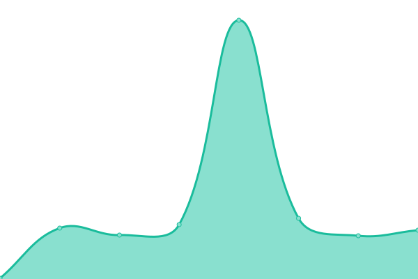
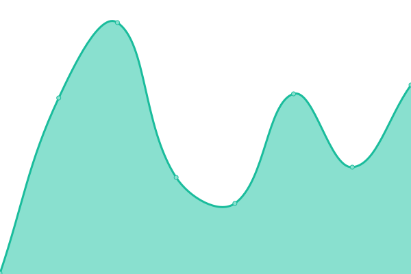
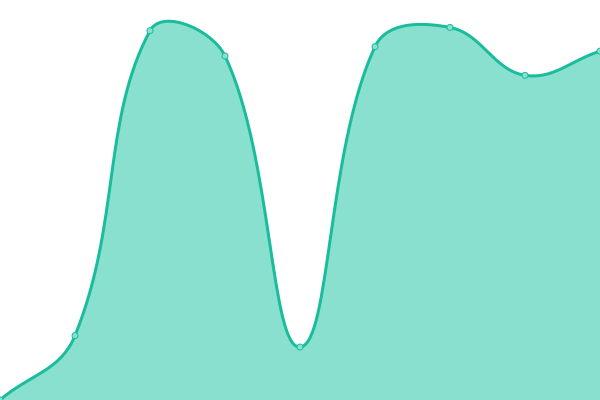

# [📈 ライブステータス](https://monitor.takao.eu.org): <!--live status--> **一部システム停止中**

[Upptime](https://github.com/upptime/upptime)は、オープンソースの稼働時間モニターとステータスページでこのリポジトリは[Takao-Site](https://monitor.takao.eu.org)が管理しています。

[Upptime](https://upptime.js.org)を使用すると、GitHub リポジトリを利用して、無制限かつ無料の独自の稼働時間モニターとステータスページを取得できます。

インシデントレポートとして[Issues](https://github.com/Takao-Site/monitor.takao.eu.org/issues)、稼働時間モニターとして [Actions](https://github.com/Takao-Site/monitor.takao.eu.org/actions)を使用します。

ステータスページは[Status Page](https://monitor.takao.eu.org)をご覧ください。

<!--start: status pages-->
<!-- This summary is generated by Upptime (https://github.com/upptime/upptime) -->
<!-- Do not edit this manually, your changes will be overwritten -->
<!-- prettier-ignore -->
| URL | Status | 履歴 | 応答時間 | 稼働状況 |
| --- | ------ | ------- | ------------- | ------ |
|  [Google](https://www.google.com) | 稼働中 | [google.yml](https://github.com/Takao-site/monitor.takao.eu.org/commits/HEAD/history/google.yml) | 

 78ms
     
 | 

<a href="https://monitor.takao.eu.org/history/google">100.00%</a>
    

|  [Cloudflare DNS](1.1.1.1) | 稼働中 | [cloudflare-dns.yml](https://github.com/Takao-site/monitor.takao.eu.org/commits/HEAD/history/cloudflare-dns.yml) | 

 47ms
     
 | 

<a href="https://monitor.takao.eu.org/history/cloudflare-dns">100.00%</a>
    

|  [Takao](https://takao.eu.org) | 稼働中 | [takao.yml](https://github.com/Takao-site/monitor.takao.eu.org/commits/HEAD/history/takao.yml) | 

 169ms
     
 | 

<a href="https://monitor.takao.eu.org/history/takao">100.00%</a>
    

|  [Takao Development](https://dev.takao.eu.org) | ダウン | [takao-development.yml](https://github.com/Takao-site/monitor.takao.eu.org/commits/HEAD/history/takao-development.yml) | 

 0ms
     
 | 

<a href="https://monitor.takao.eu.org/history/takao-development">0.00%</a>
    

|  Site Management | 稼働中 | [site-management.yml](https://github.com/Takao-site/monitor.takao.eu.org/commits/HEAD/history/site-management.yml) | 

 513ms
     
 | 

<a href="https://monitor.takao.eu.org/history/site-management">100.00%</a>
    

|  Comment Management | 稼働中 | [comment-management.yml](https://github.com/Takao-site/monitor.takao.eu.org/commits/HEAD/history/comment-management.yml) | 

 6782ms
     
 | 

<a href="https://monitor.takao.eu.org/history/comment-management">100.00%</a>
    

<!--end: status pages-->

[**ステータスページを訪れる →**](https://monitor.takao.eu.org)

## 📄 License

- Powered by: [Upptime](https://github.com/upptime/upptime)
- Code: [MIT](./LICENSE) © [Takao-Site](https://monitor.takao.eu.org)
- Data in the `./history` directory: [Open Database License](https://opendatacommons.org/licenses/odbl/1-0/)
